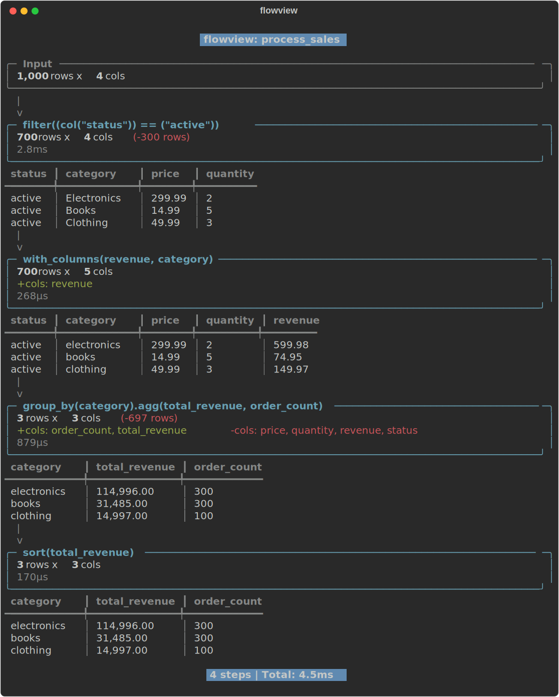

# flowview

[](https://github.com/guillermodotn/flowview/actions/workflows/ci.yml)
[](https://pypi.org/project/flowview/)
[](https://pypi.org/project/flowview/)
[](https://github.com/guillermodotn/flowview/blob/main/LICENSE)

Visual data pipeline debugger for Polars. Stop print-debugging your pipelines.

<p align="center">
  
</p>

## Install

```bash
pip install flowview
```

## Usage

```python
import polars as pl
import flowview as fv

def clean(df: pl.DataFrame) -> pl.DataFrame:
    return df.rename({col: col.lower() for col in df.columns})

def filter_active(df: pl.DataFrame) -> pl.DataFrame:
    return df.filter(pl.col("status") == "active")

def add_revenue(df: pl.DataFrame) -> pl.DataFrame:
    return df.with_columns((pl.col("price") * pl.col("quantity")).alias("revenue"))

@fv.trace
def process(df: pl.DataFrame) -> pl.DataFrame:
    return (
        df.pipe(clean)
          .pipe(filter_active)
          .pipe(add_revenue)
    )

df = pl.DataFrame({
    "status": ["active", "inactive", "active"],
    "price": [10.0, 20.0, 30.0],
    "quantity": [2, 1, 3],
})

result = process(df)
```

The `@fv.trace` decorator intercepts each `.pipe()` call and renders a visual flow in your terminal showing:

- Row counts at each step (with diffs)
- Schema changes (added/removed columns)
- Sample data at each transformation
- Execution time per step

## Options

```python
@fv.trace(sample_rows=3, show_sample=True, show_schema=True)
def process(df):
    ...
```
